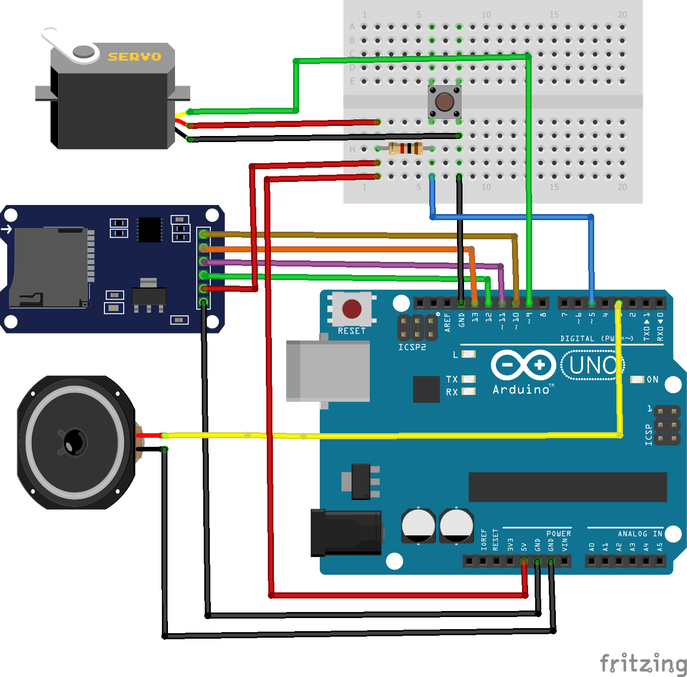
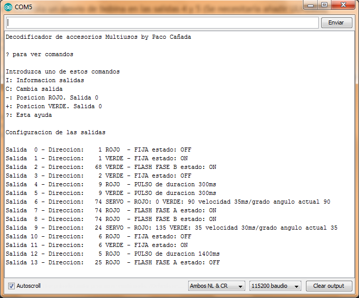

# Lenguaje de Programación Arduino

Esta pequeña guía práctica surge como un hilo sobre "Nociones básicas para programar en C del Arduino o entender los listados", en el foro [CTMS](https://www.ctms1.com/) (Control Tren Modelo por Software). Se ha trasladado aquí el contenido de ese hilo en forma de libro pensando en los aficionados al modelismo ferroviario que desean acercarse a la programación de Arduino para aplicarlo en sus maquetas.

Este es un libro de iniciación al lenguaje de programación Arduino en el que en cada capitulo se avanza un poco más en el conocimiento del lenguaje con ejemplos aplicados al modelismo ferroviario.

---

# Contenido

## Lenguaje de programación Arduino
## Capítulo 1. Nociones básicas

Nociones básicas del lenguaje Arduino. Funciones básicas del skecth: setup() y loop()

## Capítulo 2. Ejemplo clásico: Blink

El ejemplo clásico de parpadeo de un LED usando el Arduino. Control de un pin como salida y pausas.

## Capítulo 3. Otro ejemplo simple

Control de un LED al pulsar un boton. Lecura de un pin de entrada digital.

## Capítulo 4. Ejemplo simple para la maqueta. Luces obras

Luces intermitentes para señalizar obras en la maqueta. El bucle for()

## Capítulo 5. Librerías incluidas en Arduino IDE

Control de la posicion de un servo desde un potenciometro. Entradas analogicas y libreria Servo.h

## Capítulo 6. Otras librerías

Sencillo sketch de decodificador de accesorios DCC de una salida. El Gestor de librerías.

## Capítulo 7. Otras temporizaciones: Luces de edificio aleatorias

Luces aleatorias para animar edificios. Numeros aleatorios y millis()

## Capítulo 8. Librerías incompatibles: Placa giratoria por segmento y sonido

Placa giratoria de segmento accionada por servo con sonido real (archivo .wav) almacenado en una tarjeta SD. Uso de switch()-case

## Capítulo 9. Uso de 'shields': Plataforma deslizante con motor paso a paso

Control de una plataforma deslizante de 5 salidas con motor paso a paso. Con deteccion de final de carrera para un posicionamiento preciso. Shields de motores y uso de struct{} y while()

## Capítulo 10. Los Strings: Botón Pulsador de Acción

Pulsador de accion que permite controlar hasta 3 servos y 10 salidas segun una secuencia programada. La secuencia se escribe en un String como sencillas ordenes (mover servo, encender, apagar, pausa, bucle). Strings y librerias en .zip

## Capítulo 11. Comunicaciones (Serie e I2C): Reloj-Pantalla de andén

Pantalla para anden con control por el puerto serie. Tambien muestra la hora real y la temperatura. Usa una pantalla OLED de 0.96" (128x32 pixels) y un chip de reloj DS3231. El operador ternario y uso de Serial y otras librerias.

Video:

## Capítulo 12. Bits y PWM: Tren lanzadera analógico

Tren lanzadera (ida y vuelta) en analogico por PWM con aceleracion y frenado usando solo la Arduino Motor Shield. Salidas analogicas (PWM) y registros del Arduino.

Video:

## Capítulo 13. De la idea al programa: Paso a nivel DCC

Decodificador DCC para paso a nivel con servo, luces de carretera y luz para el maquinista. Programacion top-down y libreria NmraDcc.h

## Capítulo 14. Bits problemáticos: Bits serie y retroseñalización S88

Interfaz a ordenador con protocolo P50 para lectura de retromodulos S88. Registros de desplazamiento y uso de Serial con datos binarios.

## Capítulo 15. Memoria EEPROM: Decodificador de accesorios multiusos

Decodificador DCC de accesorios configurable desde el puerto serie. Puede controlar 14 salidas como tipo fijo, intermitente, pulso o servo. Uso de la EEPROM y formateado de textos.

## Capítulo 16. Interrupciones: Mando XpressNet para panel

Sencillo mando para control de locomotoras con conexion Xpressnet, encoder rotatorio y display de 4 digitos. Uso de la libreria XpressNet.h, las interrupciones y union{}

## Capítulo 17. Gestor de tarjetas y colas: Lanzador de rutas XpressNet

TCO Xpressnet de hasta 56 teclas y con asignacion por puerto serie de desvios o rutas para cada tecla. Usa un Arduino Pro Micro. Uso de otros tipos de Arduino con el Gestor de tarjetas y las colas FIFO.

## Capítulo 18. Sketch en varios archivos: Megafonía para la maqueta

Decodificador DCC para megafonia y sonido ambiente de la maqueta con el DFPlayer. Reproduce hasta 144 archivos .wav y .mp3 desde la tarjeta SD con solo 16 direcciones de accesorios. Preprocesamiento y prototipado de funciones del compilador de Arduino.

## Capítulo 19. Crear librería: Decodificador DCC para señales RENFE

Creación y uso de una librería que muestre varios aspectos en una o varias señales de varias luces acorde con el Reglamento General de Circulación de RENFE. Creacion de librerias propias, paso de parametros por valor y por referencia.

## Capítulo 20. Máquina de estados: Control de un funicular

Automatismo para el funicular BRAWA (Standseilbahn 6410) instalado en un modulo con pùlsador para accionar por el publico. Programacion de una maquina de estados finitos (FSM).

## Capítulo 21. Baterias y Neopixels: Diorama en un tarro de cristal

Diorama de un tren a escala N en un tarro de cristal con luz efecto día/noche usando un Neopixel y un Arduino Pro Mini. Modos de bajo consumo, frecuencia procesador y medicion tension alimentacion con el ADC.

Video:

## Capítulo 22. Pantalla táctil: TCO Xpressnet táctil

TCO con una pantalla táctil ILI9341 y conexión Xpressnet. Usos de #define. Definición de iconos. Panel táctil resistivo.

Video:

## Anexo I. Referencia al Lenguaje

## Anexo II. Librerías

---

Paco Cañada

https://usuaris.tinet.cat/fmco/

https://fmcopaco.github.io/